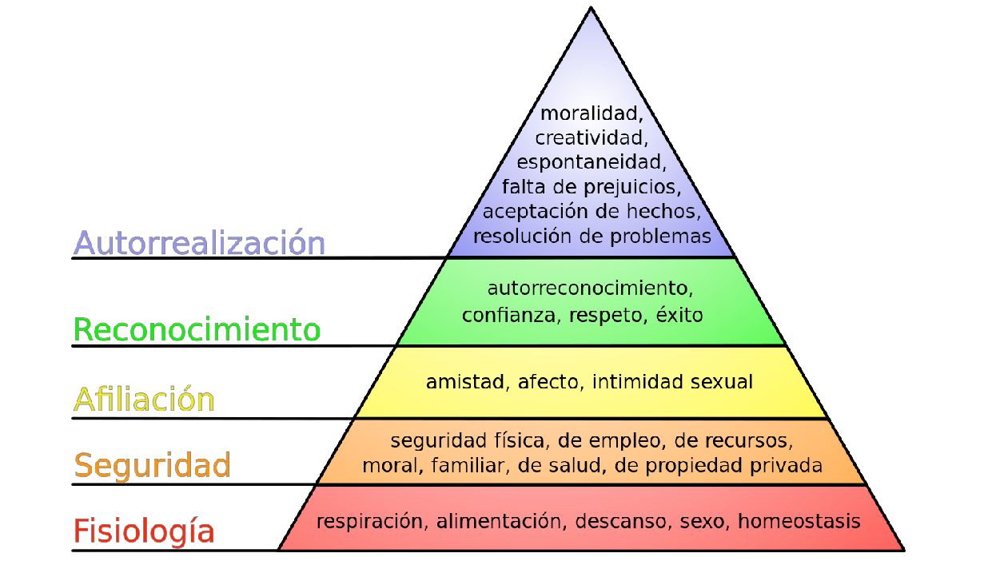
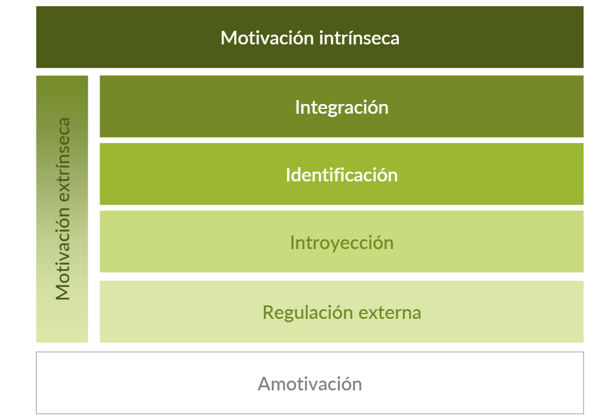
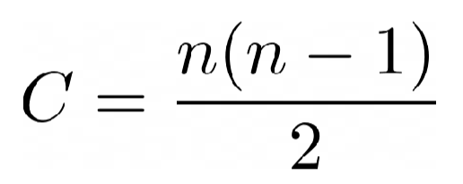

# Conceptos de los vídeos de la semana 1 

## Theory pill on Project Management:

### 1) INTRODUCCIÓN A PMBOK:
En este vídeo se realiza un repaso sobre conceptos ya vistos en otras asignaturas relacionados con la gestión de proyectos y su ciclo de vida

- Áreas de conocimiento de PMBOK:
    - Gestión de la calidad
    - Gestión de los costes
    - Gestión del alcance
    - Gestión del tiempo
    - Gestión de la comunicación
    - Gestión de los interesados
    - Gestión de los recursos humanos
    - Gestión de las adquisiciones
    - Gestión de Riesgos

### 2) CAUSAS DE FRACASOS:
Antes de detallar estas áreas se ofrece una breve explicación sobre las causas que provoca que los proyectos fracasen habitualmente:

- Falta de planificación
- Hacer caso omiso de la gestión de riesgos
- Dejar que tu ego conduzca el proyecto
- No controlar ni el coste, ni el tiempo, ni la calidad
- Asfixiar al equipo
- Crear horarios surrealistas
- Ser incoherente
- No hacer nada (la mayoria de proyectos de esta asignatura fracasan debido a la ultima causa)

A continuación se explica el concepto análisis-parálisis, el cual trata de buscar la solución perfecta a un problema determinado, lo cual es poco eficiente debido a que lo mejor para este tipo de situaciones es dar una solución e iterar para mejorarla.

### 3) SIN EQUIPO NO HAY PROYECTO:
con este lema nos quieren hacer entender que las relaciones humanas en el contexto de un proyecto en equipo son imprescindibles para un resultado exitoso. Existen múltiples foros donde compartir tus propios conocimientos a la comunidad, por ejemplo, Stack Overflow.
Con ello, se muestra el manifiesto ágil, que da preferencia a una buena comunicación con el cliente antes de realizar un trabajo exhaustivo qeu no satisfaga sus necesidades. Estos son sus principios:
- Individuos e iteraciones vs procesos y herramientas
- Software en funcionamiento vs documentación exhaustiva
- Colaboración con el cliente vs negociación contractual
- Respuesta ante el cambio vs seguir un plan

De acuerdo a estos principios, se emplea la metodología de trabajo Scrum, ya que se trata de una metodología ágil.

### 4) FORMAS DE SER DERROTADO:

- **No calibrar el númeor de fuerzas:** Equilibrar la carga de trabajo en el equipo
- **Ausencia de un sistema claro de recompensas y castigos:** esto puede provocar falta de motivación y responsabilidad en el equipo  para alcanzar los objetivos del proyecto.
- **Insuficiencia de entrenamiento:** puede resultar en la incompetencia para manejar las tecnologías, herramientas o metodologías específicas del proyecto. Esto puede conducir a errores, retrasos y la entrega de un producto final de baja calidad.
- **Pasión irracional** la falta de razonamiento objetivo puede llevar a decisiones impulsivas o a la adopción de soluciones no fundamentadas.
- **Ineficacia de la ley del orden**  puede dar lugar al caos, a la falta de comunicación, a la coordinación ineficiente y a la confusión en las responsabilidades.
- **No seleccionar a soldados fuertes y resueltos** El equipo de proyecto debe estar formado por profesionales competentes y dedicados, de lo contraio, se corre el riesgo de enfrentar desafíos más grandes de lo necesario y de tener dificultades para superar obstáculos.

### 5) PMBOK: GESTIÓN DE LOS RECURSOS:
En este apartado es fundamental la presencia de lo siguiente:
- #### ROLES:
    - **ROL:** Descripción de la parte del proyecto de la que esresponsable 
    - **RESPONSABILIDAD:** Definición del trabajo que ha de realizar a fin de completarsus asignaciones o actividades
    - **AUTORIDAD:** Definición de los niveles en los que el rol es responsable dela toma de decisiones, puede solicitar recursos para elproyecto y/o aprobar solicitudes.
    - **HABILIDADES:** Competencias específicas y transversales que debe teneruna persona que asuma este rol

- #### ORGANIGRAMA DEL PROYECTO:
debe de definirse la responsabilidad de los miembros del equipo en cada tarea mediante matrices RACI. Ejemplo:
| Actividad                | PM       | Ingeniero de Software | DevOps   | Programador Senior | Programador Junior |
|-|-|-|-|-|-|
| Recopilar requisitos|A|R|C|I| |
| Diseño de la solución|A|R|C|I| |
Implementación| |A|I|R|R|
Pruebas de software| |A|I|R|R|
Implantación|A| |R|I|I|
Pruebas de aceptación |A|R|I|I|I|

Donde:  
**R:** Persona responsable   
**A:** Persona aseguradora   
**C:** Persona consultada   
**I:** Persona informada

- #### GESTIÓN DEL PERSONAL:
Incluye adquisición de personal, entrenamiento, revisión de rendimiento, reconocimiento y recompensa.

### 6) DESEMPEÑO Y RECONOCIMIENTO:
En esta sección se explica que lo habitual en nuestro día a día es no premiar aquellas actividades que han finalizado correctamente dentro de la planificación, ya que es lo que el equipo de trabajo debe hacer.

- #### REVISIONES DE RENDIMIENTO Y DESEMPEÑO:
Con ánimo constructivo y que permita a las personasmejorar en futuras actuaciones y definir un plan deformación acorde.

- #### RECOMPENSAS:
Se pueden definir recompensas no necesariamenteeconómicas en caso de éxito del proyecto. Hay que diseñarcorrectamente el reconocimiento individual ya que puedenentenderse como un castigo si está mal diseñado.

- #### CULTURA EMPRESARIAL:
La cultura empresarial y el ambiente laboral se trabajadesde el reconocimiento de las personas y del trabajo,además del respeto a la diversidad.

### 7) PRODUCTIVIDAD:
Se describe cómo se mide la productividad en el equipo, definiendo la siguiente ecuación:
<h4 align="center">PRODUCTIVIDAD GRUPAL = Σ PRODUCTIVIDAD INDIVIDUAL - RUIDO</h4>
Es decir, la productividad grupal se define como la suma de las productividades individuales del equipo menos el ruido (horas muertas en las que se malgasta el timepo o no se es totalmente eficiente, por ejemlpo, reuniones sin conclusiones, revisión del correo electrónico e interrupciones como consultar el teléfono móvil...)

### 8) MARCO DE TRABAJO:
En este apartado se recomienda no establecer un método de trabajo. En su lugar, se prefiere proponer un método, aplicarlo, medir su efectividad, hacer restrospectiva y volver a la etapa 1. Siguiendo este flujo de trabajo se conseguirá un método eficiente para llevar un progreso continuo en el equipo.

#### TÉCNICAS RECOMENDADAS:

- **GESTIÓN DE COMUNICACIONES:**
- **TÉCNICA POMODORO:**
- **CONTROL DE TIEMPO:**

Estas técnicas nos beneficiarán en la medición de la productividad y no sobrecargarno en horas continuadas de trabajo.

###  9) GAMIFICACIÓN:
Es una técnica de aprendizaje que traslada la mecánica de los videojuegos al ámbito educativo-profesional con el fin de conseguir mejores resultados

- **PIRÁMIDE DE MASLOW:**  
Se trata de una pirámide que jerarquiza la motivación humana en base a tipos de necesidades, desde la fisiológica a la autorrealización

- **TEORÍA DEL APRENDIZAJE:**  
En esta sección se explica la necesidad de abordar un proyecto con la técnica de gamificación, se tratan temas como la curva de aprendizaje durante el uso de una aplicación, la necesidad de retarse de los usuarios y la motivación que les florece de forma intrínseca.

- **TEORÍA DE LA AUTEDETERMINACIÓN:**  
Esta teoría conlleva un orden, no es solo una clasificación. Ejemplo: las redes sociales, que comenzaron perteneciendo al grupo de Amotivación y han acabado en el grupo de Integración debide al frecuente uso de ellas en la sociedad.

### 10) 8 TIPOS DE DIVERSIÓN:
- **SENSACIÓN:** el juego como sensación de placer
- **FANTASÍA:** el juego como fantasía
- **NARRATIVA:** el juego como una historia por descubrir
- **DESAFÍO:** el juego como carrera de obstáculos
- **COMPAÑERISMO:** el juego como red social
- **DESCUBRIMIENTO:** el juego como territorio inesplorado
- **EXPRESIÓN:** el juego como método relajante
- **SUMISIÓN:** el juego como pasatiempo

### 11) GESTIÓN DE LAS COMUNICACIONES:
En este apartado se especifica una ecuación para determinar los canales de comunicación que debería haber en el equipo:

  
Donde:
- C = número de canales
- n = interesados del proyecto

En este plan de gestión se da respuesta a las siguientes preguntas:
- ¿QUÉ INFORMACIÓN NECESITAN LOS INTERESADOS? 
- ¿QUIÉN RECIBIRÁ Y QUIÉN DISTRIBUIRÁ LAINFORMACIÓN?
- ¿CUÁNDO NECESITARÁN LA INFORMACIÓN?
- ¿CÓMO SE DISTRIBUIRÁ LA INFORMACIÓN?¿CUÁNTOS CANALES EXISTEN?
- ¿QUÉ TECNOLOGÍA SE UTILIZARÁ?¿QUIÉN SE COMUNICA CON QUIÉN? 
- ¿CON QUÉ FRECUENCIA SE REALIZARÁ LACOMUNICACIÓN?

## Theory Pill on Analysis Competitors and Effective Presentations

### 1) COMPETITOR ANALYSIS:
- Proceso de identificar competidores en un mercado y evaluarlos según un conjunto de criterios de negocio predeterminados.

- Objetivo: detectar debilidades de estas empresas o productos y así poder potenciar los nuestros.

- Hecho correctamente, un análisis de competidores puede proveer datos para mejorar nuestras estrategias, decisiones de negocio, atención al cliente y la calidad de nuestros productos.

#### Tipos de Competencia
Suelen tener el mismo modelo de negocio, moverse en el mismo mercado, y tener la misma audiencia objetivo.

- **A nivel de negocio**: Productos o servicios similares. Tamaño y comunidad parecidos.
- **Aspiracional**: Grandes marcas que tienen una comunidad superior a la nuestra. Nuestro objetivo es llegar a ser como ellas.
- **Palabras Clave**: No tienen porqué ofrecer el mismo servicio. Están dirigidos hacia la misma audiencia. Es la competencia en aspectos de marketing.

#### Four Basic Steps
El análisis de la competencia se realiza siguiendo 4 pasos:

##### Identificación de la competencia
    - Centrarse en competidores directos con la misma audiencia objetivo
    - Se pueden detectar a través de:
        - **Búsqueda de mercado**: mediante, por ejemplo, palabras claves
        - **Feedback de los clientes**: Preguntar a clientes por sus otras opciones
        - **Redes sociales**
    - Herramientas para la identificación de competidores: **Semrush**
    - Cuadrante de crecimiento: Ritmo al que los competidores se expanden en el mercado. 4 Tipos:
        - **Empresas de nicho**: Nuevas o pequeñas empresas con poco tráfico y un bajo crecimiento.
        - **Agentes de cambio**: Empresas emergentes que, a pesar de que todavía no tienen bastantes clientes, están teniendo un rápido crecimiento.
        - **Líderes de mercado**: Empresas con gran audiencia y alto crecimiento.
        - **Empresas establecidas**: Compañías con una gran audiencia ya consolidada
    - Mapa de posicionamiento: Relación entre número de palabras clave comunes vs tráfico

##### Investigar cada competidor en base a las 4P's
    - **Product**:
        - Identificar los más populares.
        - Funcionalidades que ofrecen.
        - Problemas que resuelven.
        - Audiencia objetivo.
    - **Pricing**:
        - Comparar los planes de precio.
        - Comprobar si regularmente tienen rebajas, descuentos u otros tipos de ofertas.
    - **Place**: 
        - Dónde compra su público los productos.
        - Canales que emplean para llegar al público (Redes sociales).
    - **Promotion**:
        - Canales que tienen un mayor rendimiento.
        - Tienen una marca definida?
    
    Herramientas para extraer información de empresas: 
        - ahrefs
        - similarweb
        - metricool

##### Construir perfiles de los competidores
    - Clasificar y ordenar la información obtenida
    - Objetivos:
        - Comprender correctamente el mercado
        - Identificar posibles debilidades y fortalezas
        - Preveer posibles movimientos
        - Comparar competidores entre sí
    - Existen plantillas para realizar los perfiles

##### Análisis DAFO
    Identificar aquellos factores tanto internos como externos que pueden favorecernos o desfavorecernos para lograr nuestro objetivo futuro.

    Matriz DAFO:
    - **Debilidades**:
        Interno y Negativo.
        - ¿Qué podemos mejorar?
        - ¿Con qué están nuestros clientes insatisfechos?
        - ¿En qué fallamos y nuestros competidores no?
        - ¿Qué conocimientos o recursos nos faltan?
        - ¿Gastamos más que generamos?
        - ¿Nuestra atención al cliente es correcta?
        - ¿Nuestros esfuerzos no llegan a los objetivos?
    - **Amenazas**:
        Externo y Negativo.
        - ¿Qué está haciendo la competencia?
        - ¿Cómo pueden nuestras debilidades dejarnos vulnerables?
        - ¿Para qué tendencias en el mercado no estamos preparados?
        - ¿Qué cuestiones económicas o políticas pueden impactar a nuestro negocio?
        - ¿Nuevos competidores emergentes?
    - **Fortalezas**: 
        Interno y Positivo.
        - ¿Qué estamos haciendo bien?
        - ¿Qué les gusta a nuestros clientes de nosotros?
        - ¿Dónde resaltamos?
        - ¿Qué hace que nuestra empresa sea única?
        - ¿Tenemos más tráfico que nuestros competidores?
        - ¿Tenemos funcionalidades que no tengan nuestros competidores?
    - **Oportunidades**:
        Externo y Positivo.
        - ¿Qué tendencias emergentes podemos aprovechar?
        - ¿Qué oportunidades tenemos en otros posibles mercados?
        - ¿Existe otros mercados con menos competidores donde nuestro producto tenga cabida?
        - ¿Hay lugares con menos competencia?
        - ¿Cambios en el mercado que nos favorezcan?
        - ¿Nuevas redes sociales?

##### Errores comunes
    - No encontrar a todos nuestros rivales.
    - No utilizar palabras clave en nuestras búsquedas.
    - No conocer las noticias, novedades y tendencias de la industria.
    - No monitorizar las nuevas noticias o menciones sobre nuestros competidores.
    - Infravalorar a nuestros competidores.
    - No tener un constante y continuo estudio de cuales son nuestros competidores.
    - No compartir esta información con los integrantes de la empresa

    Respecto a la matriz DAFO:
    - No ser completemente honestos.
    - No completar el análisis.
    - Escribir una lista de competidores demasidado larga o demasiado específica.
    - Sobreestimar nuestras fortalezas.
    - No enfocarse lo suficiente en las oportunidades.
    - No subestimar a los competidores.
    - No dedicar el tiempo suficiente al análisis.

### 2) EFFECTIVE PRESENTATIONS:
El contenido de la presentación debe ser el mínimo para que el presentador se sienta cómodo y le sirva de apoyo. Además, que la audiencia pueda comprender y enlazar la información proporcionada.

#### ¿Qué hacer?
    - Presentación sencilla.
    - Estructura atractiva.
    - Utilizar contenido audiovisual.
    - Usar un fondo minimalista.
    - Mantener consistencia con la fuente y tamaño de letra.

#### ¿Qué no hacer?
    - Sobrecargar las diapositivas.
    - Quedarse quieto en mitad de la presentación.
    - Utilizar siempre el mismo tono de voz.
    - Repetir el contenido varias veces.
    - Poner grandes bloques de texto.

#### Errores comunes
    - Miedo a hablar en público.
    - No llamar la atención de la audiencia.
    - No saber que contenido o cuánto poner en las diapositivas.
    - Estar incómodo al incorporar comunicación no verbal.

#### Consejos
    - Contar todo como si fuera una historia.
    - Sonreís y buscar contacto visual.
    - Cuidar la presencia.
    - Empezar fuerte.
    - Hacerlo con pasión.
    - Planificar la actuación.
    - Practicar y ensayar.
    - Estar tranquilos y cómodos

#### The 10-20-30 Rule
    Regla básica para realizar una presentación efectiva.
    - 10 diapositivas.
    - 20 minutos.
    - Tamaño de letra 30.
