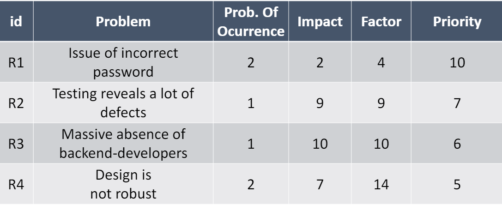
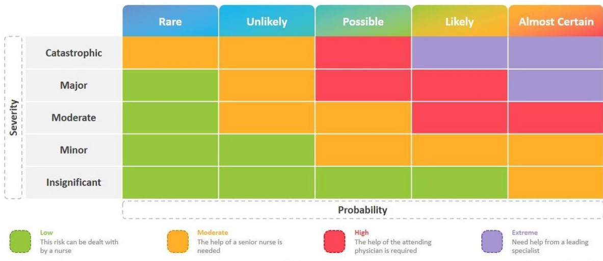
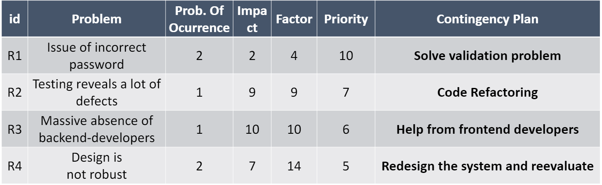
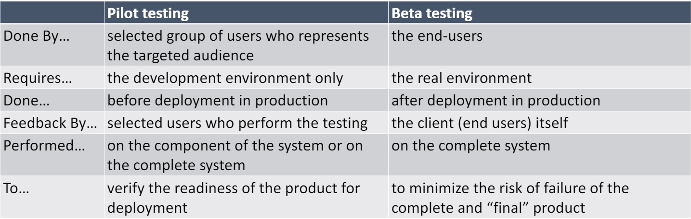

# Conceptos de los vídeos de la semana 2 

## Theory pill - Killer Openers, User Pilots Management and Risk Management:

### 1) KILLER OPENERS:
En este video, primeramente se nos habla de los Killer Openers, o técnicas para comenzar de manera efectiva una presentación. Se repasan distintos tipos de Killer Openers: 

- #### The Shock Opener
    - Esta técnica busca asustar o sorprender a la audiencia.
    - Se puede sorprender de muchas maneras, pero todas se basan en los principales sentidos VAKS:
        - **Visual**
        - **Auditory**
        - **Kinesthetic**
        - **Smell**
    - Un ejemplo puede ser contar a la audiencia un hecho o estadística sorprendente que les haga cuestionar sus pensamientos.
    - No siempre es necesario llamar la atención con un abridor impactante, ya que también se puede utilizar un enfoque más sutil.

- #### The Story Opener
    - Esta técnica consiste en contar una breve historia que resuma el discurso.
    - Es importante que ja historia sea identificable.
    - Una opción es contar la mitad de la historia al principio y la otra mitad al final de la presentación.

- #### The Intrigue Opener
    - Esta técnica busca intrigar a la audiencia con un misterio.
    - Al comienzo de la presentación, se debe introducir el misterio y a lo largo de ella se debe ir dando pistas y resolviendo, a la vez que se va hilando con el contenido de la presentación.
    - Es importante que no sea un rompecabezas aleatorio o extremadamente difícil.

- #### The Prop Opener
    - En esta técnica se utiliza un objeto para llamar la atención de la audiencia
    - Por ejemplo, se puede empezar el discurso oliendo una rosa.
    - Se puede usar un objeto o burlarse de la audiencia por la ausencia de un accesorio
    - El accesorio debe ser parte integral de la charla.

- #### The Funny Opener
    - Esta técnica consiste en hacer reír al público
    - El humor es subjetivo, pero si se hace reír a una parte de la audiencia, muy probablemente la otra parte será contagiada por las risas.

- #### The Inspirational Opener
    - En esta técnica la presentación se abre con una cita.
    - Esa cita debe actuar como una historia, en el sentido que establezca el tono y tema del discurso.
    - Una cita eficaz suele tener solo una línea y estar respaldada por la credibilidad del autor original que pronunció esas palabras.
    - Hay que intentar utilizar una cita que pocas personas hayan oído alguna vez.

- #### The Perspective Shift Opener
    - Esta apertura guiará a la audiencia en una dirección antes de cambiar de dirección y establecer un nuevo ritmo para el discurso.
    - Un ejemplo es un cambio de vestimenta en el escenario. Con este cambio se establece un nuevo tono, sensación y dirección para el discurso.

- #### The Silence Opener
    - Este abridor consiste en crear silencio al comienzo de la charla para afectar profundamente a la audiencia y su enfoque.

- #### The Big Promise Opener
    - Esta técnica busca crear una gran promesa o llegar a un acuerdo con el público: escúchame y obtendrás algo a cambio.
    - Esta promesa será el título de la presentación o la *frase rentable*, la cual es una frase fundamental recurrente que se utilizará a lo largo de su presentación.
    - Crear una gran promesa al comienzo de su discurso es como agregar un avance al comienzo de un programa de televisión.

Es importante recordar que estas técnicas no son excluyentes y que se pueden combinar como se desee

### 2) RISK MANAGEMENT:

- #### Risk Identification
    - Partir de una lluvia de ideas identificando las posibles acciones que tienen riesgo dentro del proyecto.
    - Estos riesgos se deben listar y clasificar.
    - Los riesgos se pueden clasificar en distintos tipos:
        - **Estimación**: Se estima que una tarea va a tardar en realizarse un mayor o menor tiempo del que realmente se necesita.
        - **Técnicos**: Sobrevalorar la capacidad de los miembros del equipo al usar una tecnología.
        - **Requisitos**: Modificación de los requisitos.
        - **Organizacionales**: Riesgos respecto a la organización o comunicación dentro del equipo.
        - **Internos**: Problemas internos en el equipo o en un integrante.
        - **Externos**: Problemas por factores externos al equipo, como factores ambientales.
        - **Internos-Externos**: Riesgos en los que afectan factores internos como externos.
    - Factores que normalmente pueden ser riesgos:
        - Grado de innovación tecnológica.
        - Requisitos cambiantes.
        - Arquitectura poco planificada.
        - Falta de testing (rendimiento).
        - Baja calidad del software.
        - Deadlines agresivos.
        - Baja productividad.
        - Documentación pobre.
        - Falta de compromiso.
        - Falta de comunicación-
        - Dependencia de otros desarrolladores (Bus factor).
        - Problemas de presupuesto.
- #### Risk Analysis & Prioritization
    - Identificar problemas potenciales.
    - Probabilidad de ocurrencia.
    - Impacto de los problemas.
    - Asignar valor.
    - Calcular factor de riesgo y priorizarlos.

- #### Risk Avoidance and Mitigation
    - Crear un plan de contingencia para cada riesgo.

- #### Risk Monitoring
    - Monitorizar los riesgos constantemente.
    - Si un riesgo ocurre: 
        - 1) Consultar el plan de contingencia
        - 2) Tomar acciones correctivas y definir objetivos
        - 3) Comprobar que las acciones correctivas están siendo efectivas. Esto se sabrá midiendo si se están cumpliendo los objetivos definidos
        - 4) Si no se están cumpliendo los objetivos, cambiar de acción correctiva
    - Existen herramientas para la gestión de riesgos:
        - OneTrust
        - Risk.Net

### 3) USER PILOTS MANAGEMENT:
    - Select Participants
    - Test Scenarios
    - Test Plan & Feedback Survey
    - Communications Plan
    - Conduct Pilot
    - Assess Learnings

- #### Select Participants
    - Correcta selección de los participantes que van a ser usuarios piloto.
    - Los usuarios pilotos deben ser parte del público objetivo.

- #### Test Scenarios
    - Buena selección de los escenarios que van a probar los usuarios pilotos.
    - Debe quedar claro el escenario que se va a probar.
    - Existen softwares para definir una guía del escenario que se está probando.

- #### Test Plan & Feedback Survey
    - Buena planificación de cuando se van a hacer las pruebas.
    - Encuesta para recoger feedback de los usuarios piloto.
    - Preguntas adecuadas y no muy complejas.
    - Estableces métricas de éxito específicas para las preguntas del formulario.
    - Monitorizar la tendencia de las evaluaciones de cada usuario piloto.
    - Definir objetivos ponderables.

- #### Communications Plan
    - Buen plan de comunicación con los usuarios piloto.
    - Siempre disponible para el feedback de los usuarios pilotos.
    - Canales de comunicación muy claros: *Slack*, *iTop*.
    - Calendario claro.

- #### Conduct Pilot
    - Fomentar la buena ejecución del pilotaje.
    - Dar beneficios a los usuarios piloto.

- #### Assess Learnings
    - Sacar conclusiones y lecciones aprendidas.
    - Usuarios pilotos deben sentirse que se les ha tenido en cuenta

- #### Pilot Testing vs Beta Testing

