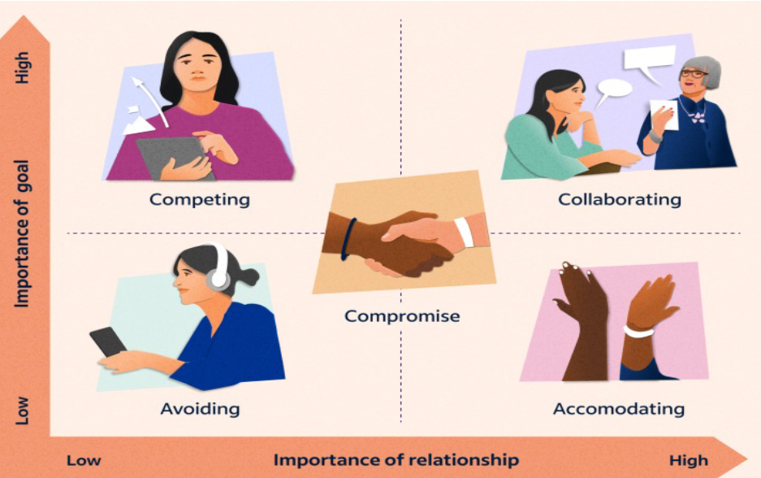
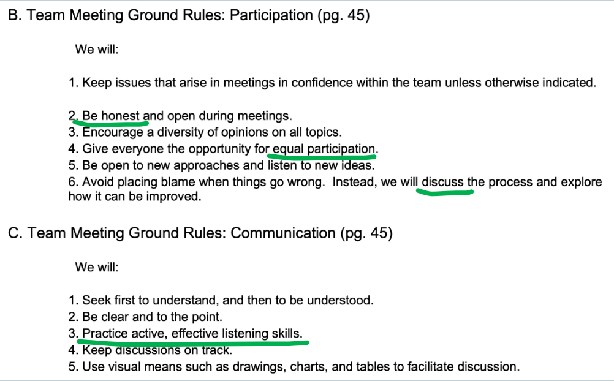

# Conceptos de los vídeos de la semana 5

## Theory Pill on ALM, Sprint Planning and Performance

### 1) APPLICATION LIFECYCLE MANAGEMENT:
En primer lugar, se explica la estrategia de branching GitFlow, que ya todos deberíamos saber:

Si hay algún problema al entender esto recomiendo ver los primeros minutos del vídeo.

**Application Lifecycle Management (ALM)**: Es el conjunto de herramientas que nos da soporte para poder desarrollar una aplicación. Dentro de estas herramientas tenemos:

- Code Management Action: Gestión de código (Github)
- Continuous Integration: Integración contínua. Lanzamiento de pruebas y paso a producción automatizado (Github Actions)
- Project Management Action: Herramienta de gestión de proyecto (Github Projects)
- Deployment Management Action: Herramienta para desplegar en la nube (Google Cloud)

**Prácticas de equipo recomendables**:
- Al menos el 75% de las issues que están en progreso deben de correlacionarse con la creación de una rama.
- Al menos el 75% de las issues que están en revisión deben de correlacionarse con la creación de una Pull Request.
- Al menos el 75% de las issues que están completadas deben de correlacionarse con una Pull Request mergeada.
- Cada vez que se acepte una Pull Request, esta debe tener como mínimo una review positiva.
- Cada miembro del equipo solo puede tener una o ninguna issue en progreso a la vez.
- Cada miembro debe completar al menos una issue cada semana.
- Cada miembro del equipo debe dar una review en todas las Pull Request al menos una vez.
Estas prácticas pueden ser monitorizadas usando la herramienta (Team Practice Agreement) Governify. Esta herramienta actualiza los datos cada hora

### 2) SPRINT PLANNING:
En primer lugar, recomienda que el primer sprint esté formado por los requisitos para conseguir el MVP y los user cores. Esto permite tener las reviews de los usuarios piloto sobre las funcionalidades principales cuanto antes, y así poder mejorarlas según el feedback recogido.

En el Sprint Planning hay que refinar las tareas y dividirlas en subtareas que se van a abordar en el sprint. 

Para cada issue, al principio del sprint, se debe:
- Calcular la complejidad. Para esto se pueden utilizar varias herramientas como:
    - Planning Poker: Simular un juego en el que todo el mundo se debe poner de acuerdo para ver cuántos puntos se le asigna a cada tarea. 
- Asignar a 1 persona. Se puede tener un plan de contingencia para que otra persona pueda ayudar, pero asignar más de una persona a una issue no es recomendable.
- Realizar una descripción detallada. Puede tener adjuntos como mockups.
- Etiquetar. Etiquetas como backend, frontend, documentación, bug, crítico...
- Proponer un rango de fechas para empezar y terminar.

Para cada issue, al final del sprint, se debe:
- Realizar un Sprint Retrospective. Qué ha funcionado, qué no ha funcionado, qué hay que mejorar, qué cosas quedan para el siguiente sprint. Se puede hacer con herramientas como Reetro.

**Análisis de Rendimiento (Performance Tracking)**:
    - Recomendable:
        - Centrarse en la evolución y velocidad de cada integrante. No hacer un análisis aislado.
        - Hay que pensar en cuántos puntos (de complejidad) se logran, no en cuantas horas se invierten.
        - Métricas simples fáciles de calcular.
        - Enfocarse en recompensas y no penalizaciones.
    - No olvidar:
        - Hacer Training y planes de contingencia (a quién acudir si me bloqueo)
        - Team Building (hacer actividades recreativas para tener más sentimient de equipo)
        - Medir motivación (Calendario Niko-Niko)

## Theory Pill on Conflict Management, Effective Demos and Feedback Management

### 1) CONTINGENCY PLAN FOR TEAM PROBLEMS:

#### Teamwork Challenges:
    - Falta de claridad en los objetivos y alcance. Se puede evitar definiendo claramente y dejando escrito cuáles son las expectativas clave
    - Problemas de confianza entre miembros del equipo. Hay que promover actividades fuera del entorno de trabajo que permitan mejorar las relaciones
    - Conflictos de personalidad. Se puede evitar reasignando tareas para que no se encarguen de la misma tarea las personas afectadas. También se puede nombrar una figura de mediación.
    - Retención de información. Es necesario fomentar políticas de comunicación para que todo el mundo conozca todas las decisiones que se toman.
    - Falta de comunicación. Debe haber comunicación fluida entre todos los miembros. Se pueden utilizar herramientas software de mensajería.
    - Compromiso reducido. Es importante fomentar el compromiso entre todos los involucrados. Hay que enfatizar la importancia del trabajo de cada individuo. Hay que mostrar los resultados del trabajo hecho.
    - Excesivo número de integrantes en un equipo. Para remediarlo se pueden reasignar tareas y separar responsabilidades.
    - Competencia interna excesiva. Para minimizarla habrá que fomentar las recompensas de los objetivos del equipo más allá que las de los objetivos individuales.
    - Diferencias filosóficas. Una alternativa es identificar una figura de autoridad para que escuche y aclare dudas que considere problemáticas, siempre teniendo en cuenta cada opinión.
    - Enfrentamientos habituales. Se recomienda tener un código de conducta para definir las normas de actuación frente a actitudes problemáticas.
    - Objetivos opuestos. Los miembros realizan tareas incompatibles con las que han realizado otros miembros. Hay que proporcionar objetivos claramente definidos.
    - Trabajar de manera aislada. Puede hacer que no se integre el trabajo. Se deben hacer reuniones de coordinación que permitan que se escuchen todas las opiniones.
    - Falta de autoconciencia. Un individio no se da cuenta de que está causando problemas o situaciones incómodas. Se necesita una figura de liderazgo que se lo haga saber de forma privada.
    - Superposición de habilidades. Hay que identificar las habilidades, tanto las ya definidas como las potenciales, de cada miembro para asignarles las tareas que mejor les convengan

#### Conflic Resolution Strategies:
La forma de resolver conflictos depende de la personalidad de los involucrados:
    - Ignorar o evitar el conflicto: Para relaciones y objetivos de poca importancia. Puede ocasionar que el problema se vuelva más grande, así que no suele aportar soluciones.
    - Competir o imponerse sobre la opinión del resto: Para objetivos importantes y relaciones poco importantes. No aporta soluciones cooperativas, así que no suele aportar soluciones.
    - Acomodarse: Para relaciones importantes y objetivos poco importantes. Una de las partes consiente y cede. Resuelve problemas a corto plazo para ganar tiempo y resolverla a largo plazo.
    - Colaborar. Para relaciones y objetivos importantes. Trabajar con la otra parte para encontrar una solución común. Se conoce como todos ganan
    - Compromiso o reconciliación: Acuerdo mutuo para resolver una disputa. Todos renuncian a satisfacer sus necesidades para llegar a un acuerdo. Esta estrategia se usa si no se consigue que alguna de las partes cambie de opinión. Se conoce como todos pierden

#### Team Commitment:

#### Crucial Actions
- Respecto a roles y responsabilidades:
    - Asignar tareas a más de un miembro del equipo para verificar.
    - Control de calidad
- Respecto a generar evidencias:
    - Grabar reuniones
    - Realizar control de versiones en los documentos
    - Guardar correos electrónicos y mensajes
- Respecto a evitar conflictos:
    - Tener una planificación clara a corto plazo con hitos específicos
    - Plan de mitigación por si no se logra cumplir con los hitos planificados.

### 2) EFFECTIVE PRODUCT DEMOS:

#### Qué tener en cuenta?
- Una buena demostración muestra a los usuarios potenciales las capacidades del producto y por qué son útiles para ellos
- Demostrar que se han escuchado los problemas del cliente resaltando las funcionalidades personalizadas para ellos.
- No hacer parecer el producto complicado y confuso.
- No hacer una demostración estandarizada.
- No mostrar errores o bugs.

#### Tips para una Demostración efectiva:
- Simple y clara
- Orientada a resolver un problema específico.
- Usar datos reales.
- Casos de uso y escenarios reales.
- Si es una nueva versión del producto, hacer comparaciones con la anterior.
- Contar una historia y resaltar el valor que aporta esa historia. Servirá como hilo conductor que muestre cual es el objetivo y contexto del producto que se está presentando.
- Ensayar la presentación delante de un auditorio de prueba.
- Menos es más. No hay que dar demasiados detalles. Resaltar lo más relevante y diferenciador.
- Enganchar a la audiencia. Haciendo preguntas, mostrando imágenes llamativas y haciendo un llamado a la acción.

#### Pasos para crear un vídeo de demosytración:
- Asegurarse de tenerlo todo planificado: Se puede realizar un storyboard.
- Delimitar el presupuesto y el alcance de la demostración teniendo en cuenta:
    - El equipo que se tiene.
    - Guión
    - Grabación
    - Imágenes
    - Música
    - Edición
- Definir un guión: Tanto de los textos como de la música.
- Ser creativo para captar la atención en los primeros segundos.
- Destacar las funciones que satisfacen las necesidades ardientes cuanto antes.
- Empezar fuerte. Los primeros 15 segundos son los más importantes.
- Editar el vídeo: Para resaltar lo más relevante y quitar lo que no aporte información.
- Crear plan de marketing: Para saber como se va a difundir el vídeo para que llegue a las personas para quienes fue pensado.

### 3) CUSTOMER FEEDBACK MANAGEMENT:
Es el proceso de recopilar, analizar y tomar medidas sobre los comentarios de los clientes con el objetivo de optimizar la experiencia del usuario. Es un proceso cíclico que se va a realizar más de una vez a medida que se vaya avanzando en el desarrollo.

#### Recoger Feedback:
- ¿Cómo?
    Depende del tipo de audiencia a la que nos dirijamos:
    - En persona
    - Entrevista online
    - Formularios en papel.
    - Aplicación
- ¿Què?
    Depende del producto y de qué queramos analizar:
    - Customer Satisfaction (CSAT)
    - Goal Completion Rate (GCR)
    - Customer Effort Score (CES)
    - Missing Feautures (MF)
    - Surplus Features (SF)
    - Usability (US)
- ¿Cuándo?
    Hay que definir una frecuencia. Debe ser constante y realizarse varias veces. Planificar fechas:
    - Passive Feedback: El cliente elige cuándo dar feedback mediante un botón o formulario en la aplicación.
    - Active Feedback: Al cliente, al realizar una acción en la aplicación, le aparece un formulario.

#### Analizar Feedback:
Hay que saber que se quiere analizar para enfocarse en ello. Se puede realizar mediante varios tipos de gráficos. Suele analizarse a lo largo del tiempo para saber qué versión de la aplicación gusta más.

#### Tomar acciones:
- 1. Clasificar los comentarios mediante etiquetas.
- 2. Asignar tareas sobre el feedback a equipos concretos de acción.
- 3. Configurar alertas para mantenernos atentos a cuándo vamos a recibir feedback. Mediante emails por ejemplo.
- 4. Automatizar la distribución a herramientas externas mediante webhooks. Los webhooks envían datos en vivo a la aplicación que se elija.

#### Buenas Prácticas:
- Establecer objetivos claros.
- Garantizar un sistema metódico.
- Capacitar al personal.
- Revisar el feedback constantemente.
- Recoger feedback a través de múltiples canales.
- Utilizar el feedback para mejorar la interfaz y experiencia de usuario.
- Vigilar las últimas tendencias, estrategias y herramientas que pueden surgir.