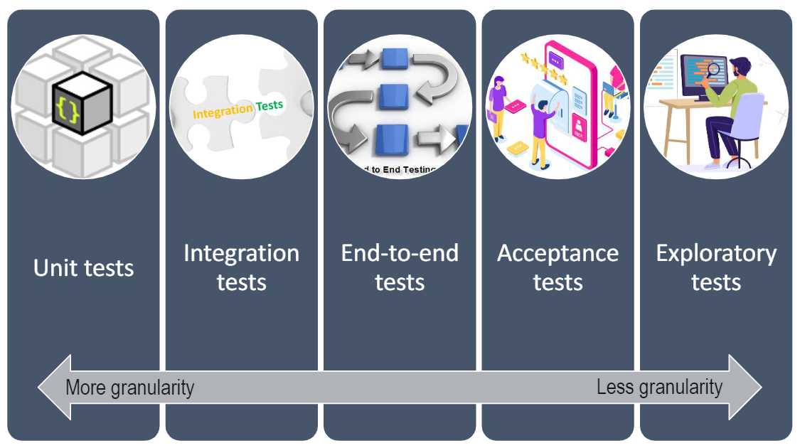
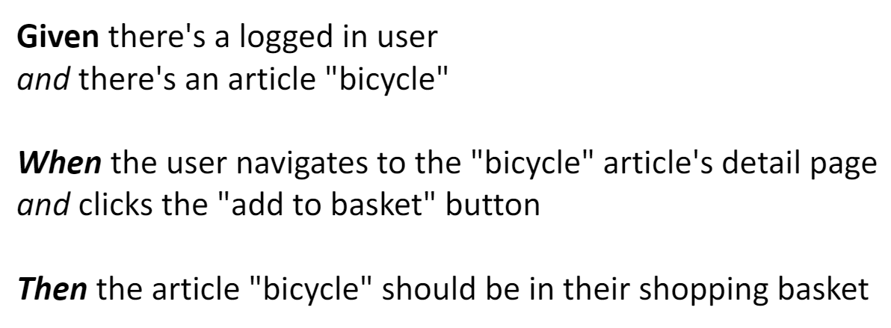
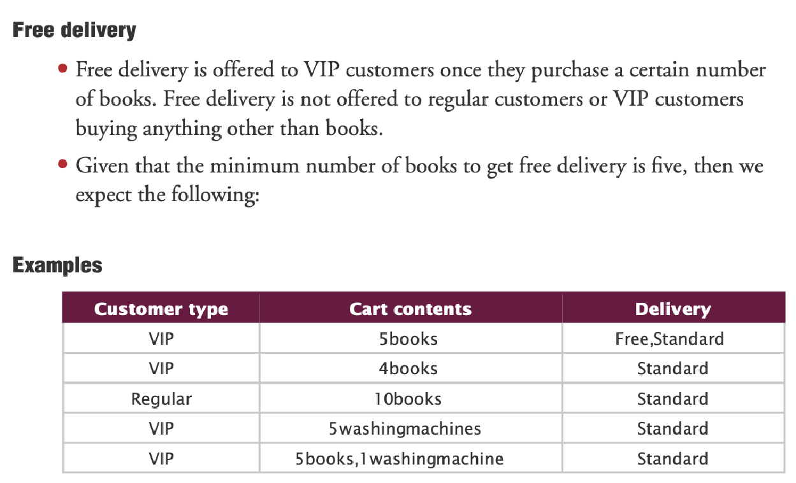
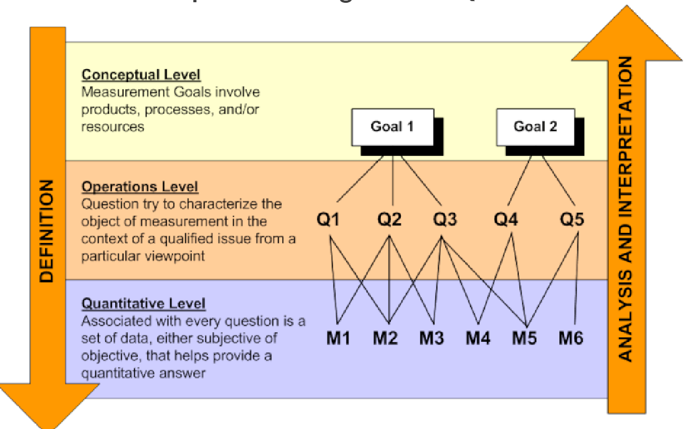
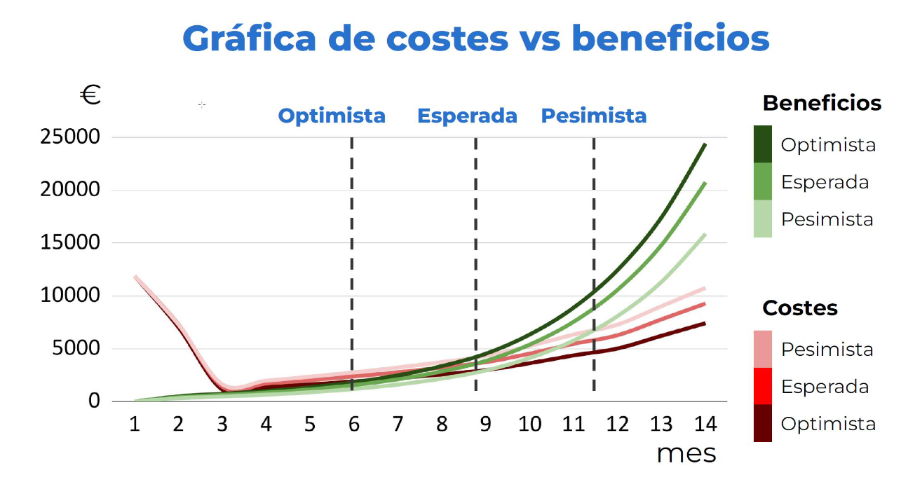
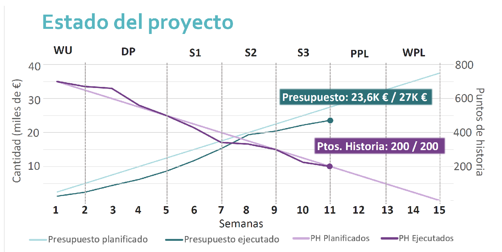

# Conceptos de los vídeos de la semana 7

## Theory Pill: Testing
El testing puede demostrar la existencia de bugs, pero no su ausencia

Tipos de tests ordenados de menor nivel de granularidad o abstracción a mayor:

### 1) Test Unitario

- Se prueba una unidad
- La mayoría de tests en una Test Suite deben ser unitarios
- Tienen un menor alcance
- Deben ser capaces de ejecutarse rápidamente
- Normalmente, si para ejecutar una unidad hacen falta módulos externos, bases de datos externas o servicios externos, se suelen remplazar con dobles de tests

### 2) Test de Integración
Incluso si los módulos están probados unitariamente, los bugs pueden seguir existiendo

Hay que asegurarse de que la conexión con elementos externos funcionan correctamente y que la información intercambiada se procesa correctamente. No hay que testear la lógica otra vez

Ejemplo de test de integración de una base de datos:
    - 1) Arrancar base de datos
    - 2) Conectar aplicación a la base de datos
    - 3) Lanzar una función que está dentro del código que escriba datos en la base de datos
    - 4) Comprobar que los datos esperados han sido escritos en la base de datos, leyendo directamente de la base de datos

Ejemplo de test de integración de un servicio externo:
    - 1) Arrancar la aplicación
    - 2) Arrancar una instancia del servicio externo o un doble de test con la misma interfaz
    - 3) Lanzar una función que está dentro del código para que lea la API del servicio externo
    - 4) Comprobar que la aplicación procesa el mensaje de manera correcta

### 3) Test End-To-End
Comprueba el sistema integrado por completo desde la interfaz de usuario. Son muy lentas

### 4) Test de aceptación
Se centra en validar. ¿Lo que se ha construido cumple con lo que el cliente quería?

Se definen escenarios de test de aceptación usando ejemplos.
Los escenarios de los tests de aceptación a menudo se definen antes de empezar a escribir código.

Se pueden usar tablas como ejemplos:

Hay herramientas que permiten la automatización de estos tests

### 4.5) Test de Interfaz de Usuario
Tanto los tests de aceptación como los testa end-to-end son implementados normalmente como tests de interfaz de usuario.

Se recomienda el uso de Katalon Recorder + Selenium + JUnit 5

#### Katalon Recorder
Es una extensión para el navegador que automatiza la generación de scripts para pruebas de interfaz de usuario mediante la grabación de tus acciones en el navegador

Permite:
    - Grabar casos de prueba como una secuencia de acciones
    - Hacer play, debug y pausar o reanudar casos de tests automatizados
    - Hacer un report con logs y capturas de pantalla
    - Tener suites tests de interfaz de usuario
    - Exportar scripts de Selenium a Python, Java(TestNG, JUnit), C#, Ruby(RSpec), New Rely Synthetics(Javascript)...

¿Por qué usar Katalon Recorder?
    - Compatible con muchos navegadores
    - Crea tests en JUnit y con muchas más bibliotecas de testing

#### Selenium: Browser WebDriver

- Selenium permite interpretar el script creado por Katalon para el navegador
- WebDriver es la recomendación de W3C desde junio de 2018

### 5) Test Exploratory o manual

- Es un enfoque de test manual. Todos los tests vistos pueden ser automatizados excepto por este tipo.
- Usar un conjunto de datos de prueba destructivos y se intenta provocar errores en la aplicación
- Documentar todo lo que se ha averiguado
- Escribir tests automatizados con los fallos encontrados

### 6) Pruebas de Rendimiento
Prueban como funciona un sistema en términos de estabilidad y respuesta ante una carga particular de trabajo

- Las pruebas de rendimiento deben realizarse en un entorno de preproducción. Simula el entorno de producción con máquinas similares en capacidad de rendimiento. Nunca hacer pruebas de rendimiento en entornos de desarrollo ni de producción.

- Hay 2 tipos:

#### Test de Carga
- Identifica cuello de botella cuando se aplican distintos niveles de carga de usuarios a la aplicación
- Se debería tener herramientas de monitorización

#### Test de Estrés
- Determina el tiempo de ruptura en el que la aplicación empieza a no comportarse adecuadamente

- Herramientas: 
    - Locust
    - Apache JMeter
    - NeoLoad
    - Gatling (Se le da más importancia en el vídeo)

## Theory Pill: Replanning, Story Boards, and Expenses_Revenues Estimation

### 1) Sprint (Re) Planning

#### Herramientas

##### GQM (Goals, Questions, Metrics)

Ejemplo 1: 
    - Goal:
        - Mejorar nuestras estimaciones, reducir desviaciones y conocer las expectativas de los clientes
    - Question:
        - ¿Cúal es la capacidad media de entrega del equipo por unidad de tiempo?
        - ¿Está el equipo entregando las tareas en un estado adecuado?
    - Metric:
        - Puntos de historia
        - Rapidez
        - Porcentaje de historias de usuario completadas por sprint

Ejemplo 2: 
    - Goal:
        - Ser más productivo
    - Question:
        - ¿Donde se está perdiendo tiempo el tareas que no aportan valor?
    - Metric:
        - Process Cycle Efficiency (PCE): Identificar las actividades que contribuyen menos valor mientras que se invierte un mayor tiempo en ellas.
        - Lead Time
        - Cycle Time: Tiempo que se tarda en realizar una tarea desde que se empieza hasta cuando se acaba

##### Monte Carlo Analysis
Son herramientas utilizadas para intentar predecir cuál va a ser el rendimiento del equipo y cómo va a funcionar cuándo se tiene variables de muchos aspectos que entran en juego.

Dados datos históricos, se es capaz de predecir el tiempo que va a tardar mi equipo en completar un número de tareas.

##### BurnDown de cada Sprint
Se puede usar Zenhub o las gráficas de Github Project.

Permite identificar cuándo se han ido entregando las tareas. Hay que intentar que todas las tareas tarden lo mismo en ser entragadas.

#### ¿Cuándo Replanificar?
- Cambio de requisitos
- Cambio en la priorización de las tareas
- Mala evolución del BurnDowm
- Malas gráficas de control

#### Rule of Thumb (Regla de oro)
- Definir Sprint Goal (GQM)
- Identificar tareas que se deben hacer, que se deberían hacer y que podrían hacerse
- Asignar al 60% de la capacidad del equipo las tareas que deben hacerse
- Usar el 40% de la capacidad del equipo para replanificar si es necesario

### 2) Story Boards
Una ilustración de todos los elementos que se quieran incluir en el video. A menudo parece un conjunto de viñetas de comics y muestran las escenas clave de un video, comercial o película, escena por escena

#### Tips

- Mantenerlo lo mas simple posible
- Centrarse en la idea principal
- Ser muy visual y evitar texto

#### Pasos

- 1) Hacer una historia
    - Escenas claves
    - Guión narrativo (Introducción -> Problema -> Solución -> LLamada a la acción)
    - Nivel de detalle
    - Describir las viñetas
- 2) Diseñarla
    - Manual o digital
    - Utilizar consejos de dibujo
    - Usar rejillas para mostrar perspectiva
    - Colorear lo importante para ganar perspectiva
- 3) Añadir información adicional y detalles
    - Usar un sistema de numerado
    - Añadir movimiento de cámara
    - Detallar diálogos
- 4) Realizar un ajuste fino y revisarlo
    - Dejarlo un tiempo para retomarlo
    - Conseguir feedback de otros miembros del equipo

### 3) Expenses and Revenues Estimation (Estimaciones de gastos y beneficios)

#### Si somos demasiado optimistas nos puede llevar:

- Insuficientes beneficios y o exceso de costes
- Replanificar
- Usar reservas económicas

#### Si somos demasiado conservadores nos puede llevar:

- Exceso de beneficio y o bajos costes
- Parece bueno, pero lleva a que el servicio tenga un precio que no le corresponde

