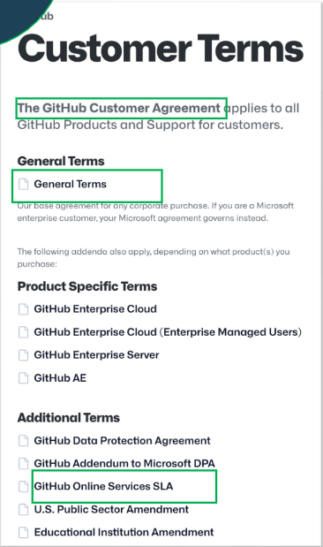

# Conceptos de los vídeos de la semana 8

## Theory Pill: Customer Agreement

### Acuerdos de Cliente
Conjunto de documentos legales que establecen los términos que regulan el uso de los servicios. Los documentos se definen en lenguaje natural y se dejan por escrito las responsabilidades de cada una de las partes involucradas.

El acuerdo de cliente es firmado para que se garantice que el cliente va a disfrutar de el servicio contratado con la calidad esperada, con un tiempo de disponobilidad, con un tiempo de respuesta, con una seguridad en los datos.

Según Chatgpt, el acuerdo de cliente es un contrato legalmente vinculante que tiene ciertos términos y condiciones, en los que se definen los derechos y responsabilidades de ambas partes, como las condiciones de pago, las políticas de uso, las políticas de privacidad... Este acuerdo suele presentarse al cliente durante el proceso de registro, y es necesario que se firme para que pueda utilizar los servicios. Este documento también es crucial para proteger a ambas partes.

Desde un punto de vista lógico, es una entidad simple que tiene tres claros elementos principales:
    - Términos de servicio:
        - Uso aceptable
        - Términos y terminación del contrato
        - Política de privacidad
        - Propiedad intelectual

    - Planes de precio:
        - Funcionalidades agrupadas por precio

    - Acuerdos a nivel de servicio (SLAs):
        - Indicadores de nivel de servicio
        - Objetivos de nivel de servicio
        - Compensaciones

Desde un punto de vista físico, lo que aparece en la web, puede ser visto como un conjunto de documentos. En el registro se debe añadir una casilla para marcar la aceptación de estos documentos y un enlace a ellos.

Mínimo contenido que se debe definir:
    - Elementos obligatorios: Descripción del servicio, términos legales y planes de precio
    - Opcional, pero recomendado: SLA
    - No existe un estándar, así que se recomienda tomar como referencia acuerdos de cliente de otros servicios como Github, Google, AWS, Microsoft... Pero simplificándolo lo máximo posible a la plantilla dada por Chatgpt.
    - Hay que asegurarse que el acuerdo de cliente no contenga claúsulas potencialmente abusivas (La plantilla de Chatgpt podría tenerlas)

Claúsulas abusivas:
    - Una claúsula es abusiva si, además de no ser negociada por las partes, causa un desbalance significante entre los derechos y obligaciones de las partes, en prejuicio del consumidor

    - Claudette es una herramienta capaz de detectar claúsulas abusivas como:
        - Finalización unilateral del contrato
        - Cambios unilaterales
        - Eliminación de contenido
        - Limitación de fiabilidad

