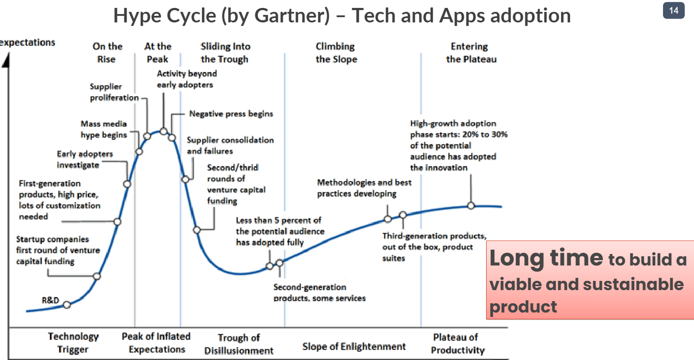
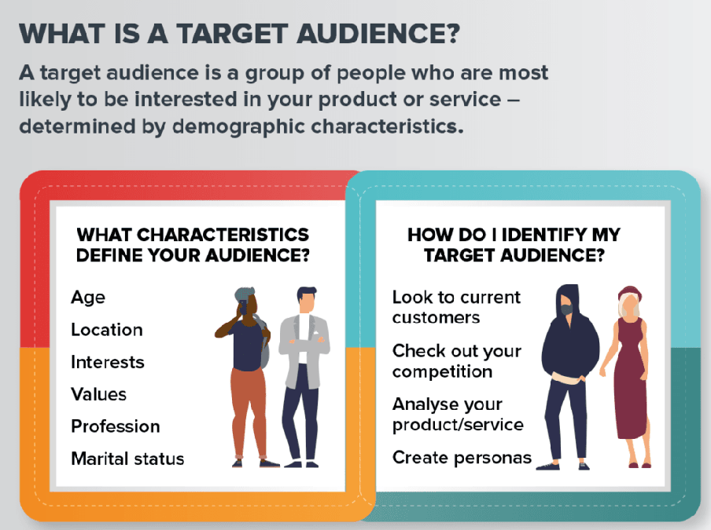
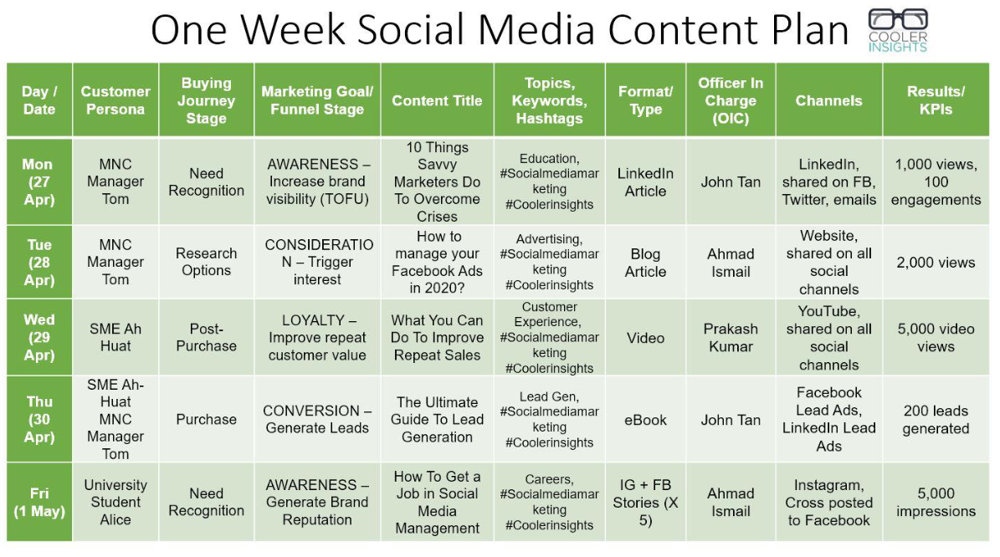
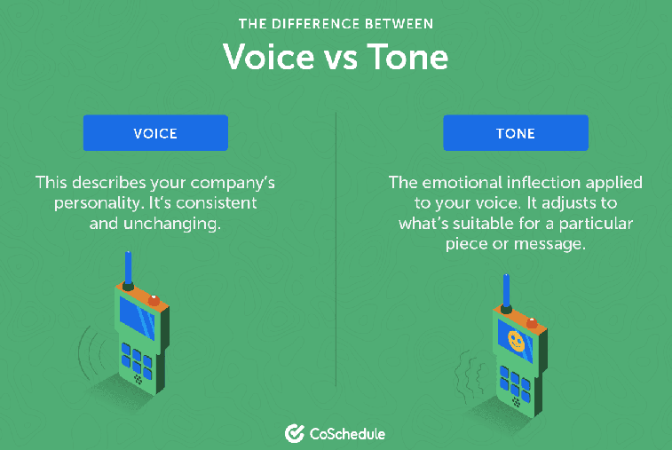
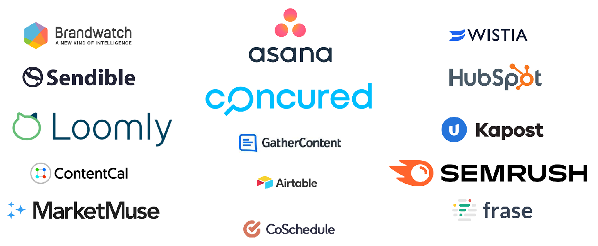

# Conceptos de los vídeos de la semana 12

## Theory pill on market segmentation, traction, and community management

### Market Segmentation Models
Es la práctica de dividir nuestro mercado objetivo en distintos grupos para acercarnos a ellos

Para ello, hay que seguir una serie de 4 pasos:

#### 1. Crear una lista de potenciales segmentos 
Hay 4 estrategias:
    - Segmentación geográfica(B2C): Basada en fronteras geográficas. Más simple
    - Segmentación demográfica(B2C): Basada en diferentes variables como edad, género, salario... Más simple
    - Segmentación firmográfica(B2B): Basada en el tipo de industria, la localización, el tamaño... Más simple
    - Segmentación psicográfica(B2C/B2B): Basada en el comportamiento, estilo de vida, aptitudes e intereses. Más compleja
    - Segmentación por comportamiento(B2C/B2B): Basada en reacciones específicas y en como los clientes van a través de procesos de compra. Más compleja
**B2B**: Bussiness to Bussiness(De una empresa a otra empresa)
**B2C**: Bussiness to Customers(De una empresa a clientes)

Las estrategias más simples las pueden usar una pequeña empresa, o cuando se realiza el primer proyecto.
Las estrategias más complejas las pueden realizar cuando se quiere identificar clientes según estilo de vida o comportamientos de compra

#### 2. Validar los segmentos obtenidos usando estudios de mercado
El estudio de mercado se hace mediante la obtención de feedback de usuarios piloto.

#### 3. Empequeñecer la lista con solamente los segmentos más prometedores
Algunos criterios a seguir:
    - Tamaño de mercado
    - Potencial de beneficio (crecimiento de mercado)
    - Barreras de entrada (competencia, regulaciones)
    - Habilidad para satisfacer la demanda (capacidad, recursos)

#### 4. Seleccionar el que tenga más potencial
Principales ascpectos a priorizar:
    - Oportunidades de mercado a corto vs largo plazo: Al comienzo entrar en un mercado pequeño, y una vez se haya ganado tracción, entrar en un mercado mayor.
    - Como se ajusta el producto al mercado: Que segmento se ajusta más al producto para tener una posición de valor para poder resonar más, y así en un futuro expander a otros segmentos.
    - Posicionamiento: Considerar aquel segmento objetivo que permite posicionarnos mejor con respecto a la competencia. Incluye planes de precio, marketing, rebajas y métodos de distribución...

Fallos comunes:
    - Hay que evitar realizar segmentos demasiado pequeños o especializados.
    - No hay que ser inflexible.
    - No hay que enfocarse en segmentos que se ven prometedores sin pensar en el dinero. Puede que un segmento más pequeño de más beneficio.

### Product Traction Management

Estrategias para ganar tracción inicial:
    - Definir claramente un objetivo
    - Lista de pre lanzamiento para que el hype suba
    - Hacer cosas que no escalan (cosas que solamente se puede hacer una vez al inicio)
    - Construir un producto alucinante
    - Encontrar buenos partners
    - Conseguir analíticas de uso actualizadas
    - Hacer listas de email
    - Utilizar casos de éxito
    - Uso de mercados adyacentes
    - Pruebas gratuitas
    - Recompensas basadas en invitar amigos
    - Co-Branding
    - Impacto en la comunidad
    - Perfiles sociales activos y actualizados

### Community Management

El **community manager** es el responsable profesional de marketing digital para la gestión y el desarrollo de la comunidad online de la marca o compañía en el mundo digital. Sus objetivos son mejorar la visibilidad de la marca y aumentar su comunidad

¿Cómo agrega valor el community manager?
    - Creación y gestión de contenido
    - Analíticas
    - Comunicación con la comunidad
    - Plan de acción de marketing digital

Pasos para ser un buen creador de contenido:

    1. **Identificar tu audiencia**

    2. **Elegir 1-2 plataformas**
    3. **Diseñar plan de contenido**

    4. **Establecer la voz de marca**
    Voz de marca se refiere a una personalidad y emoción infundida en las comunicaciones de la compañía

    5. **Invertir en herramientas third-party**

